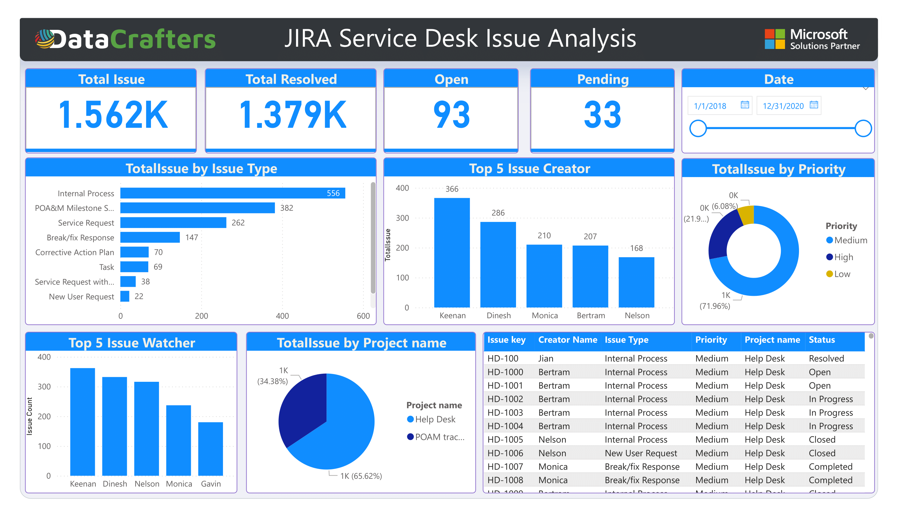
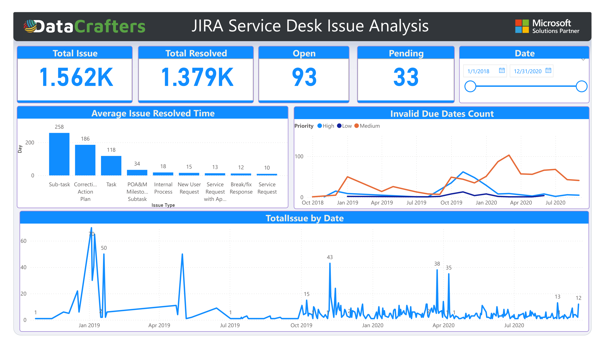

# 📊 Jira Service Desk Issue Analysis

This project presents an in-depth analysis of Jira Service Desk issues, providing key insights to improve service management efficiency.

## 🔍 Overview
The analysis explores various aspects of Jira issues, including:

- 📈 **Issue Trends:** Identifying patterns in issue creation, resolution, and escalation.
- ⏳ **Resolution Time Analysis:** Measuring average resolution times to improve efficiency.
- 📋 **Category Breakdown:** Understanding issue types, priorities, and categories for better resource allocation.
- 🟢 **Performance Insights:** Identifying top-performing agents and tracking service level agreement (SLA) metrics.

## 📷 Visual Analysis
Below are key visual insights from the analysis:

### Customer Analysis

### Issue Analysis

## 📊 Key Insights
- 🚀 **Improved Resolution Time:** Highlighted areas where teams achieved faster issue resolution.
- 🔎 **Escalation Patterns:** Identified frequent escalation trends to address root causes.
- 📋 **Categorization Strategy:** Recommended improved categorization methods for efficient ticket handling.

## 🛠️ Tools Used
- **Power BI** for visualization and dashboard creation
- **Excel** for data cleaning and preparation
- **Jira Service Desk** data for issue tracking

## 📄 How to Use
1. Clone the repository.
2. Open the Power BI file and review the dashboard insights.
3. Refer to the visual images for key insights and patterns.

## 🤝 Contributions
Feel free to raise issues or submit pull requests for improvements.

---

📧 For queries or collaboration, reach out via [LinkedIn](https://linkedin.com/in/your-profile) or [GitHub](https://github.com/Juwel2121).
